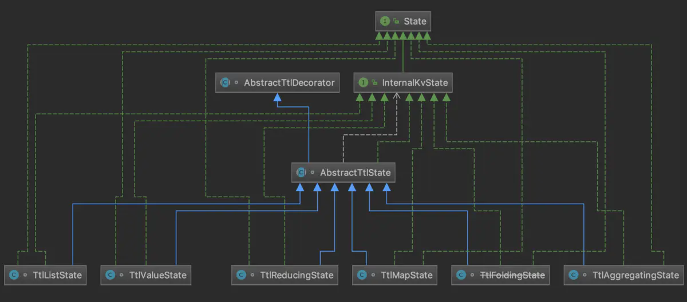

### 状态生成时间(State TTL)

为了避免状态数据无限增长引发的OOM问题，必须有一个机制能够给状态进行瘦身，从而清除掉无效状态给系统带来的影响，Flink从1.6开始引入了TTL(状态的生存
时间)机制，它支持KeyedState的自动过期，并自动清除掉过期的State。

从StateTtlConfig类来分析TTL机制的底层实现，该类中有5个成员属性，它们也是用户需要指定的参数配置。包括：
  * ttl表示用户设定的状态生存时间;
  * updateType表示状态时间戳的更新方式，它的取值类型是一个枚举;
  * stateVisibility表示已过期的状态数据的可见性，取值也是一个枚举;
  * ttlTimeCharacteristic表示对应的时间特征，取值同样是一个枚举，但实际上现阶段只支持一种时间特征，也就是处理时间;

CleanupStrategies内部类用于规定过期状态的清理策略，可以在构造StateTtlConfig时通过调用其中的方法来指定，常见的方法如下：
  * cleanupFullSnapshot()：当对状态做全量快照时清理过期数据，这对于开启增量快照的RocksDB状态后端没有作用，它对应于源码中的EmptyCleanupStrategy
  策略。由于它只能保证状态后端持久化时不包含过期数据，而对于TM本身的过期状态则不作任何清理，因此无法从根本上解决状态过大的问题;
  * cleanupIncrementally()：增量清理过期数据，默认是在每次访问状态时进行清理，如果设置第二个参数runCleanupForEveryRecord为true则也会在每
  次写入/删除时清理。第一个参数cleanupSize指定每次触发清理时检查的状态数量，它仅对基于堆的状态后端生效，对应于源码中的IncrementalCleanupStrategy
  策略;
  * cleanupInRocksdbCompactFilter()：通过FLink定制的过滤器过滤掉过期状态数据，它有一个参数queryTimeAfterNumEntries表示在写入多少条状态
  数据后，通过状态时间戳来判断是否过期。仅对于RocksDB状态后端生效，对应于源码中的RocksdbCompactFilterCleanupStrategy策略;
  
getOrCreateKeyedState()方法用于创建并记录状态实例，它定义在所有Keyed State状态后端的抽象基类AbstractKeyedStateBackend中，该函数的主要逻
辑是调用TtlStateFactory.createStateAndWrapWithTtlIfEnabled()方法来创建State，TtlStateFactory就是产生TTL状态的工厂类。由此可见，如果
我们为StateDescriptor加入了TTL，那么就会调用TtlStateFactory.createState()方法创建带有TTL的状态实例；否则，就会调用StateBackend.createInternalState()
创建一个普通的状态实例。

主要分析带有TTL的状态实例的创建方法TtlStateFactory.createState()。stateFactories是一个Map结构，维护着各种状态描述符及与之对应的产生该类状
态对象的工厂方法映射。所有的工厂方法都被包装成了SupplierWithException(这是Java 8提供的Supplier的函数式接口)，所以在上述createState()方法
中，可以通过SupplierWithException.get()方法来实际执行create*State()工厂方法，从而获得新的带TTL的状态实例，它们其实就是普通状态类名加上Ttl
前缀，只不过没有公开给用户使用。此外，在生成Ttl*State时，还会通过createTtlStateContext()方法生成TTL状态的上下文。

TtlStateContext的本质是对下面实例的封装：
  * 原始State：通过StateBackend.createInternalState()方法创建得到;
  * StateTtlConfig：状态TTL的配置;
  * TtlTimeProvider：用于提供判断状态过期标准的时间戳，目前的实现比较简单，就是代理了System.currentTimeMillis();
  * State的序列化器：通过StateDescriptor.getSerializer()方法取得;
  * Runnable类型的回调方法：通过registerTtlIncrementalCleanupCallback()方法产生，用于状态数据的增量清理;

State的相关类图如下所示：

从图中可以看到，所有的Ttl*State都是AbstractTtlState的子类，而AbstractTtlState又是装饰器AbstractTtlDecorator的子类，AbstractTtlDecorator
类是基本的TTL逻辑的封装，其成员属性除了前面在TtlStateContext已经提到过的外，还有表示在读取状态值时也更新时间戳的updateTsOnRead，以及表示即使
状态过期在状态真正删除前也返回状态值的returnExpired。而状态值与TTL的包装(封装成TtlValue，它有两个属性，userValue表示状态值，lastAccessTimestamp
表示最近访问的时间戳)和过期检测实际上都是由工具类TtlUtils负责处理的，实现上也比较简单。

AbstractTtlDecorator类的核心方法是获取状态值的getWrappedWithTtlCheckAndUpdate()，它接受三个参数：
  * getter：可以抛出异常的Supplier，用于获取状态的值;
  * updater：可抛出异常的Consumer，用于更新状态的时间戳;
  * stateClear：可抛出异常的Runnable，用于异步删除过期状态;

这说明，在默认情况下，后台清理过期状态的策略是惰性的，即只有当状态值被读取时，才会对状态做过期检测，并异步清除过期的状态。这种机制带来的问题是对于那
些实际上已经过期但没有再次被访问的状态来说将无法被清除，从而导致状态大小无限增长，这点应该引起注意。

以TtlMapState为例来分析下TTL状态的实现，从其源码中可以看出，TtlMapState的增删改查操作都是在原MapState上进行，只是通过装饰器模式增加了TTL的相
关逻辑，非常简单。但是有一点需要注意，所有的增删改查操作之前都需要执行accessCallback.run()方法。该方法会在启用增量清理策略时通过在状态数据上维护
一个全局迭代器向前清理过期数据，如果没有启用增量清理策略，则accessCallback为空。

最后分析到RocksDB压缩过滤清理策略，Flink会通过维护一个RocksDbTtlCompactFiltersManager的实例来管理FlinkCompactionFilter过滤器，这个过滤
器并不是在Flink工程中维护的，而是位于Data-Artisans中为Flink专门维护的FRocksDB库内，主要是C++代码，通过JNI调用。
 